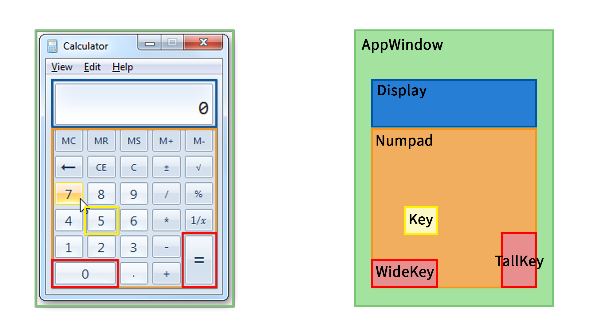

Recently I've become aware of (another) Webpack alternative - [Snowpack](https://www.snowpack.dev/). It's a relatively new project, the web technologies that make Snowpack possible only [recently](https://caniuse.com/#search=modules). The bundler claims to improve the JavaScript development experience by using [JavaScript modules](https://developer.mozilla.org/en-US/docs/Web/JavaScript/Guide/Modules) during development and compiling to compatible JavaScript for release.

> _Skip to **Getting started with Snowpack** if you know your JavaScript history_

## Explaining JavaScript Modules
Any application of a certain level of complexity needs to be broken up into modules to allow developers to keep a clean mental model of the project. In JavaScript land, [AMD](https://github.com/amdjs/amdjs-api/blob/master/AMD.md) and [RequireJS](https://requirejs.org/) were used to allow developers to import other scripts into one combined application. Recently, with the advent of React (and JSX, Typescript, anything that has a compilation step), bundlers like Webpack, Babel, and Parcel became the standard. I've used Parcel on many frontend projects and am curious with how it compares to Snowpack.

## Getting started with Snowpack
We are going to build a Windows-style calculator in React and Snowpack. This will be a learning experience for me, and hopefully you as well. There are a few things I'm going to need to do to get started:
1. Create a new directory and initialize a NPM project
```bash
mkdir reactulator
cd reactulator
npm init # and follow through the prompts
```
2. Install `snowpack` locally. Those familiar with Parcel may expect to install a bundler globally, but the Snowpack docs reccomend saving a local version so I'll do that.
```bash
npm install --save-dev snowpack
```
3. Use the [Create Snowpack App](https://github.com/pikapkg/create-snowpack-app) tool to initialize a project using the provided **@snowpack/app-template-react-typescript** template. Note that I've created the Snowpack project in a subfolder of this project to keep the frontend and any backend code we may write separate.
```bash
npx create-snowpack-app appdir --template @snowpack/app-template-react-typescript
```
4. Move into the `appdir` directory and launch the app with ```npm run start```.

Right out of the box I'm noticing hugely faster startup times than a simple Parcel application. I won't compare the performance to Webpack as all the projects I've used Webpack with have accessed the library through a bit of abstraction plus have used loads of dependencies (e.g. Gatsby). I am also noticing some issues with hot reloading after an error, but nothing that is unrecoverable.


## Application Design
I've drawn up a design of what I want this project to look like when finished. I'm just tracing over my reference image in Photoshop as I feel the layers and groups map well to UI components, but this can be done in any software or on paper.



As we see here the